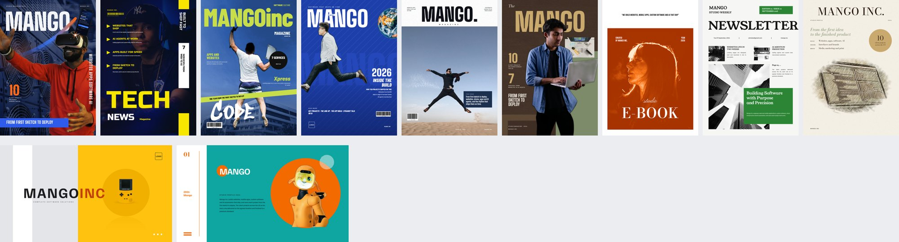
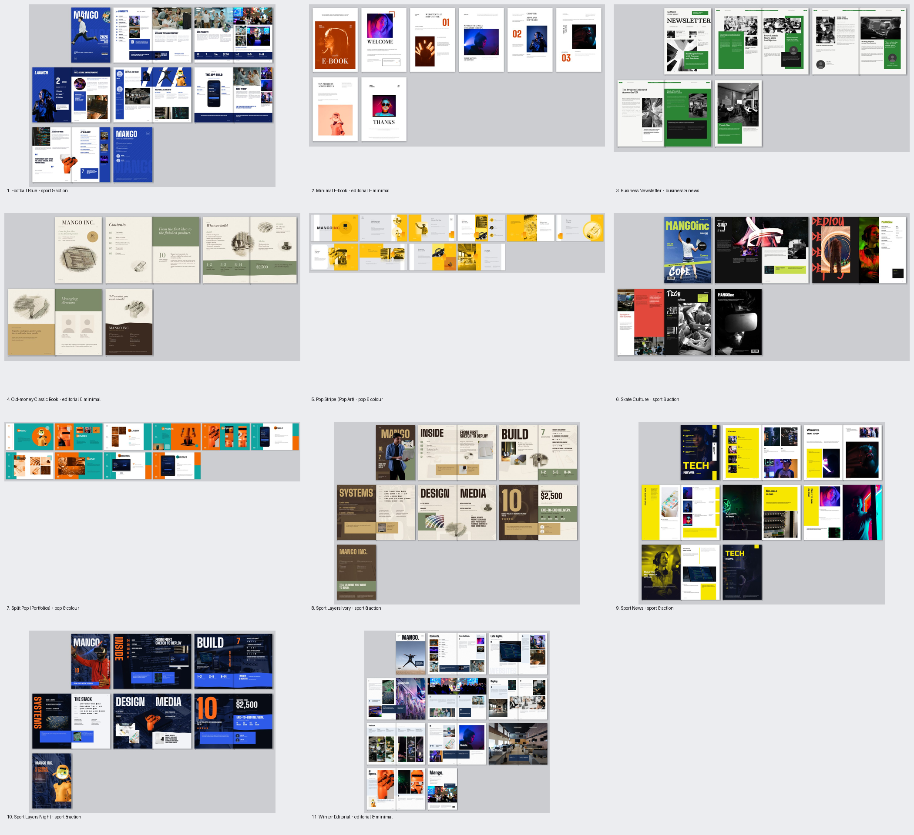

# Folio: Claude Design Skill for Posters, Brochures and Magazines

[](https://github.com/stanesjenson11-lgtm/Folio---Claude-Design-Skill-For-Poster-Brochure-Magazine#install) [](https://github.com/stanesjenson11-lgtm/Folio---Claude-Design-Skill-For-Poster-Brochure-Magazine/releases) [](https://github.com/stanesjenson11-lgtm/Folio---Claude-Design-Skill-For-Poster-Brochure-Magazine/releases) [](LICENSE) [](https://github.com/stanesjenson11-lgtm/Folio---Claude-Design-Skill-For-Poster-Brochure-Magazine)

**Design print-ready brochures, magazines, posters, company profiles, catalogs and annual reports with Claude — and get a Canva-editable version of every page, automatically.** folio is an open-source [Claude Code](https://claude.com/claude-code) plugin and Claude skill that makes Claude work like a print art director: real page layouts, a library of 11 signed-off magazine and brochure styles, AI-free copy through a built-in humanizer, automated print checks, and a taste memory that improves with every design you approve or reject.



> Every cover above was made by folio from one company's website facts (the sample client is Mango Inc., a made-up software studio: every company name, person, phone number, email and logo in the samples is a placeholder). No template was filled in by hand.

**Keywords:** Claude skill · Claude Code plugin · AI brochure design · AI magazine layout · AI poster generator · Canva editable HTML · print-ready PDF · InDesign alternative · company profile design · annual report design · catalog design · editorial design · humanize AI text · agent skills

---

## Contents
- [What folio makes](#what-folio-makes)
- [Why the designs don't look AI-generated](#why-the-designs-dont-look-ai-generated)
- [The style catalogue: 11 ready magazine and brochure styles](#the-style-catalogue)
- [How it works](#how-it-works)
- [How it humanizes copy](#how-it-humanizes-copy)
- [How it learns your taste and improves itself](#how-it-learns-and-improves)
- [Canva-editable export: every image and text box stays editable](#canva-editable-export)
- [Install](#install) · [Quick start](#quick-start) · [Slash commands](#slash-commands) · [Scripts](#scripts)
- [FAQ](#faq) · [Credits](#credits) · [License](#license)

## What folio makes

| Piece | Output |
|---|---|
| Magazines and magazine-style brochures (8–20+ pages) | Print PDF with bleed, page PNGs, spread contact sheet, Canva-editable HTML |
| Company profiles, studio books, annual reports, catalogs, quotation brochures | Same, plus client-copy verification |
| Posters and weekly poster series (4 unique variants per request) | PNG at print resolution + Canva-editable HTML |
| Flyers, trifolds (imposed in fold order), trade-show panels, stage backdrops | Print PDF + editable HTML |
| Replicas of reference pages you like ("make it 1:1 like this") | The same grid, colour blocking and devices, filled with your content, then saved as a reusable style |

Everything is built as paged HTML/CSS in real print units (mm, pt, trim, 3 mm bleed, recto/verso margins, spreads, photos crossing the gutter) and rendered with Chromium to PDF.

## Why the designs don't look AI-generated

Most AI-made PDFs are web pages printed out: the same heading-plus-cards structure on every page, rounded shadowed boxes, full-width 12 pt text, Inter, stock photos in frames, no page numbers. folio replaces each of those habits with an art director's:

- **Flatplan first.** Every page gets a layout pattern and a loud or quiet role before any HTML exists, so the rhythm of the book is planned.
- **Locked art direction.** One colour strategy, one type pair, one motif and one photo treatment, carried through every page.
- **Real print rules.** Folios and running heads, spreads, bleed, safe zones, gutter-aware placement, 250–300 ppi images.
- **Imagery from the client's world.** A software studio gets devices, its own website in phone and laptop mockups, code, servers and real technology logos, never coffee-cup lifestyle stock.
- **Aesthetic type.** Display faces from a curated roster (with free stand-ins for previews); common fonts are blocked in display roles.
- **Measured QA.** `preflight.py` catches clipped text, low-resolution images, fallback fonts, spine problems, contrast failures, decorative hairlines, too few colours, layout monotony, card shadows, lorem ipsum, and the writing tells of AI copy.
- **Look at every page.** Claude renders, looks at the PNGs, compares them with the reference side by side, and fixes what it sees before delivering.

## The style catalogue

folio ships 11 finished, user-approved styles ("kits"). Most clients bring content and a colour, not references, so folio starts from a kit, swaps in the client's colours, and fills every text and photo slot with their content. Leftover sample text or photos are a preflight error, so nothing from the sample reaches print.



| Command | Style | Looks like |
|---|---|---|
| `/folio:magazine` | Sport Layers Ivory | Espresso cover with a cut-out person, ivory pages, champagne note boxes that run across the fold, sage bands |
| `/folio:night` | Sport Layers Night | Dark, high-contrast sports magazine: layered cover, bold vertical words, blue gutter boxes |
| `/folio:sports` | Sport News | Navy and acid yellow, heavy small caps, yellow panels, a vertical cover strip |
| `/folio:football` | Football Blue | Royal-blue monthly: huge masthead broken by a cut-out, stat rows, a striped line-up band, a full-page advert |
| `/folio:skate` | Skate Culture | Lime case-switch masthead, graffiti words, red and black spreads, light-trail photography |
| `/folio:winter` | Winter Editorial | Minimal white magazine: heavy condensed heads ending in a full stop, drop caps, panoramas across the spread |
| `/folio:ebook` | Minimal E-book | White pages, neon photography, Didone caps, huge numerals |
| `/folio:newsletter` | Business Newsletter | Newspaper masthead, green blocks over black-and-white team photos, quote boxes with portraits |
| `/folio:profile` | Old-money Classic Book | Ivory, espresso, champagne and sage, coloured-pencil sketches, flowing colour bands |
| `/folio:popart` | Pop Stripe (16:9) | Grey, white and saffron stripes, circle photos with reflections, gradient cards |
| `/folio:portfolio` | Split Pop (16:9) | Side rail, teal and orange splits, letter-disc titles, phone, tablet and desktop mockups |

`/folio:styles` shows the gallery and asks family → style → colour → pages. `/folio:replicate` copies any reference you give it 1:1 and saves the result as a new kit with its own command, so the catalogue grows with every job.

## How it works

```mermaid
flowchart LR
  A[Your content, website,<br/>logo, photos or references] --> B[Intake: one round of questions<br/>type, style, colour, pages]
  B --> C[Kit or flatplan<br/>+ locked art direction]
  C --> D[Premium copy from your facts<br/>run through the humanizer]
  D --> E[Imagery from your world<br/>grade, cut-outs, mockups, logos, sketches]
  E --> F[Paged HTML/CSS in mm/pt]
  F --> G[render.py: PDF, PNGs,<br/>contact sheet, Canva HTML]
  G --> H[Claude looks at every page<br/>+ preflight.py QA]
  H -->|fix| F
  H --> I[Deliver + ask for your verdict]
  I --> J[TASTE.md, LESSONS.md,<br/>kits: the next design starts smarter]
```



1. **Intake.** folio reads what you already have (logo colours, photos, old brochures, your website), states its read of the job in one line, shows a palette swatch sheet, and asks once: brochure type (bi-fold to booklet), style, theme colour, pages. Every question has a recommended answer.
2. **Build.** It starts from a kit (`kit.py new`) or plans a flatplan, writes the copy from your facts, and makes the images: photo grading and duotones, background removal for magazine cut-outs, screenshots of your site framed in device mockups, single-colour technology logos, coloured-pencil sketches, flowing colour bands, hatched shapes.
3. **Check.** `render.py` makes the PDF, PNGs, a contact sheet and the Canva file; Claude looks at every page and runs `preflight.py` until it reports 0 errors and 0 warnings.
4. **Deliver and learn.** You say what works and what doesn't; folio records it and starts from it next time.

## How it humanizes copy

A layout can be studio-grade and still read as AI because of the words. folio builds in [blader/humanizer](https://github.com/blader/humanizer) and adapts it for print (`skills/folio/reference/copy.md`):

- Every headline, deck, caption and line folio writes goes through humanizer's patterns: no "not just X, but Y", no "Learn. Grow. Thrive." slogan rows, no "seamless", "unleash" or "where innovation meets excellence".
- **Premium from thin input.** When a client gives only a website or a card, folio still writes confident, specific lines built from real facts (services, timelines, prices, places, industries) instead of adjectives.
- **Facts are never invented.** Anything folio infers is marked `data-sample` and listed by preflight so you confirm it before printing. `preflight.py --copy copy.md` checks that every approved client sentence appears in the layout word for word.
- Client copy that reads like a chatbot draft is flagged once, with an offer to humanize it without changing a fact.

## How it learns and improves

folio gets better for you in four ways:

| Loop | What it does | Where |
|---|---|---|
| **Taste memory** | Every verdict ("love this", "no rotated headlines", "magazines should be darker") is logged with the concrete traits and turned into defaults the next design follows | `skills/folio/library/TASTE.md`, `reference/taste.md` |
| **Memory across sessions** | With the [claude-mem](https://github.com/thedotmack/claude-mem) plugin installed, verdicts and client facts are recalled automatically in later sessions | `reference/memory.md` |
| **Self-repair** | Any defect that would happen again on another document (a clipped word, a wrong export, a misleading rule) is patched into the skill itself as symptom → cause → fix | `LESSONS.md`, `CHANGELOG.md` |
| **A growing library** | References you share become layout pattern cards and direction cards; pages you approve become kits with their own slash command; `/folio:learn` studies professional work in the lanes you like | `library/`, `kits/`, `commands/` |

## Canva-editable export

Every render also writes `out/<name>.editable.html`: a flat, page-embedded file that imports into Canva with **every text block, shape and image as its own editable element**, so you can change words, swap photos and move things after Claude is done.

- **One element per thing.** Pages are fixed-size frames (A4 = 794 × 1123 px, tagged `data-document-role="page"`); text keeps its font, size, weight, tracking, case, colour and columns; photos are cropped exactly as they appear (object-fit, focal point, masks, rounded and circle crops); rotated and tilted elements keep their rotation.
- **Fonts travel with the file.** Only the Unicode subsets the text uses are embedded, plus a Google Fonts link.
- **Under 8 MB, nothing dropped.** A size budget (`--max-mb 8` by default) steps only the image encoding down, from 384 ppi to 307, 250 and, as a last resort, 192 ppi, and palette-encodes the largest transparent cut-outs, until the file fits. No element or style is removed.
- **Checked against the PDF.** Each page of the editable file is screenshotted and compared with the original; folio reports the per-page fidelity (target ≥ 97%) and writes a visual diff sheet for any page below it.

## Install

**Claude Code** (CLI, desktop app or web): this repository is both the plugin and its marketplace. In a Claude Code session run:
```text
/plugin marketplace add stanesjenson11-lgtm/Folio---Claude-Design-Skill-For-Poster-Brochure-Magazine
/plugin install folio@folio
```
or from a terminal:
```bash
claude plugin marketplace add stanesjenson11-lgtm/Folio---Claude-Design-Skill-For-Poster-Brochure-Magazine
claude plugin install folio@folio
```
Restart the session if the `/folio:` commands don't appear straight away. To update later: `claude plugin marketplace update folio` then `claude plugin update folio@folio`.

**Claude.ai / Claude desktop app (skill only):** download `folio.skill` from the [latest release](https://github.com/stanesjenson11-lgtm/Folio---Claude-Design-Skill-For-Poster-Brochure-Magazine/releases/latest) and upload it under *Settings → Capabilities → Skills*.

**From a clone:**
```bash
git clone https://github.com/stanesjenson11-lgtm/Folio---Claude-Design-Skill-For-Poster-Brochure-Magazine.git
# then in Claude Code:
/plugin marketplace add ./Folio---Claude-Design-Skill-For-Poster-Brochure-Magazine
/plugin install folio@folio
```

**Requirements** (installed on demand): Python 3.10+, then
```bash
pip install playwright pypdfium2 pillow pdfplumber numpy "rembg[cpu]"
playwright install chromium
```
`rembg` is only needed for cut-outs (its model downloads once). `npm` fetches fonts from Fontsource, with Google Fonts as the fallback.

## Quick start

Just ask; the skill triggers on brochure, magazine, poster and report work:

> Make a 12-page magazine for my bakery in the Sport Layers Night style. Facts are on example.com.

> Here are two reference brochures I like. Copy them 1:1 with our company's content.

> Redesign this old catalog PDF, same products and prices, and give me a Canva version.

> Make four poster variants for our Thursday prayer service, Tamil and English.

Or call a style directly: `/folio:night our website is example.com`.

## How this repository is laid out

```text
.claude-plugin/plugin.json        plugin manifest (name, version, keywords)
.claude-plugin/marketplace.json   makes this repo installable with /plugin marketplace add
commands/                         slash commands: /folio:styles, /folio:magazine, /folio:night …
skills/folio/SKILL.md             the skill Claude loads for brochure, magazine and poster work
skills/folio/scripts/             render, preflight, Canva export, kits, imagery, palette, fonts
skills/folio/kits/                the 11 ready styles (pages, CSS, vector assets, previews)
skills/folio/library/             layout patterns, art directions, taste memory
skills/folio/reference/           the workflow: intake, copy/humanizer, typography, formats
docs/                             README images
```

## Slash commands

| Command | Does |
|---|---|
| `/folio:styles` | Show the style gallery, ask family → style → colour → pages, build it |
| `/folio:magazine` `/folio:night` `/folio:sports` `/folio:football` `/folio:skate` `/folio:winter` `/folio:ebook` `/folio:newsletter` `/folio:profile` `/folio:popart` `/folio:portfolio` | Build a piece in that style from any content |
| `/folio:replicate` | Copy reference pages 1:1 with your content, then save the style as a new kit |
| `/folio:poster` | Four unique poster variants in your taste (PNG + Canva file) |
| `/folio:stock` | Find free, on-topic stock photos for a subject, with a contact sheet and credits |
| `/folio:taste` | Record what you liked or rejected |
| `/folio:learn` | Study professional references in the lanes you like and fold the best moves into the library |

Inside the skill there are also `brief`, `direction`, `craft`, `copy`, `critique`, `polish`, `preflight`, `refs`, `extract`, `export`, `imagery` and `promo` routes (see `skills/folio/SKILL.md`).

## Scripts

```bash
python skills/folio/scripts/kit.py list | new <kit> <project> [--brand #hex --accent #hex] | save <project> <kit> | gallery
python skills/folio/scripts/render.py brochure.html [--bleed 3] [--single] [--png-only] [--max-mb 8]
python skills/folio/scripts/editable.py brochure.html [--max-mb 8]      # Canva-editable HTML on its own
python skills/folio/scripts/preflight.py brochure.html [--copy copy.md] [--source source.md]
python skills/folio/scripts/palette.py --brand "#8B1E3F" [--from-image logo.png] --out palette
python skills/folio/scripts/imagery.py grade | motif | cutout [--person] | sketch | screenshot | mockup | logos | hatch | divide | reflect | texture | mask | prompt
python skills/folio/scripts/fonts.py "Big Shoulders Display:800,900" "Familjen Grotesk:400,700" --out fonts
python skills/folio/scripts/promo.py out --format square|vertical|landscape      # mockups, social stills, page-flip reel
python skills/folio/scripts/harvest.py old.pdf --out harvest                     # mine an old PDF for photos, copy, colours
```

kit.py, render.py, editable.py, preflight.py and imagery.py carry doctest self-checks: `python -m doctest skills/folio/scripts/<script>.py`.

## FAQ

**Can Claude design a brochure or magazine?**
Yes. With folio installed, Claude plans the pages, writes the copy, sources and treats the images, builds the layout in HTML/CSS with print units and renders a print-ready PDF, a PNG per page and a Canva-editable file.

**How do I get an editable Canva design from Claude?**
Import the `out/<name>.editable.html` folio writes on every render. Each text box, shape and image arrives as a separate element, and the file stays under 8 MB.

**Is it a replacement for InDesign?**
For brochures, magazines, company profiles, catalogs and posters, folio produces print-ready PDFs with bleed directly. If a printer insists on native InDesign files, pair it with an InDesign MCP server.

**Does it use my client's photos and fonts?**
Yes, first. It reads your logo colours, photos and old brochures before proposing anything, and uses stock only where you have none, always credited and never captioned as your team.

**Can it copy a design I like?**
Give it the reference images and ask for 1:1. It matches the grid, proportions, colour blocking, type behaviour and devices with your content, tells you every deviation (for example where contrast would fail in print), and saves the result as a reusable style.

**Does it work without references?**
Yes; that is what the style catalogue is for. Pick a style, give it your content, and it builds from a finished, approved design.

## Credits

folio learned from nine open-source design skills (impeccable, huashu-design, hallmark, taste-skill, ui-ux-pro-max, claude-design-skill, print-studio, brag, html-magazine, html-anything) and builds in [blader/humanizer](https://github.com/blader/humanizer) for copy; see `CREDITS.md`. Sample photographs in the example pieces are from Unsplash (credited on each piece's back page); technology logos come from Simple Icons and remain trademarks of their owners. Private reference material and client work are not included in this repository.

## License

[Apache-2.0](LICENSE). Fonts fetched by the scripts are SIL OFL (via Fontsource or Google Fonts).
